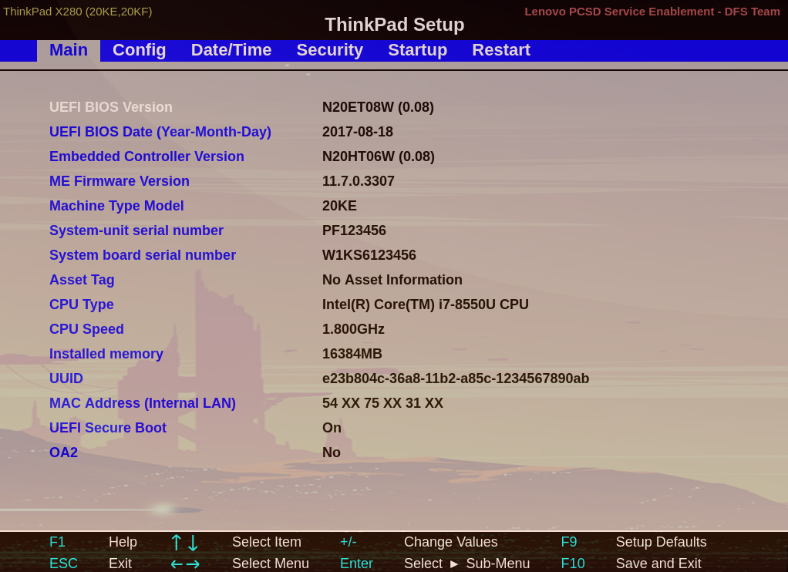
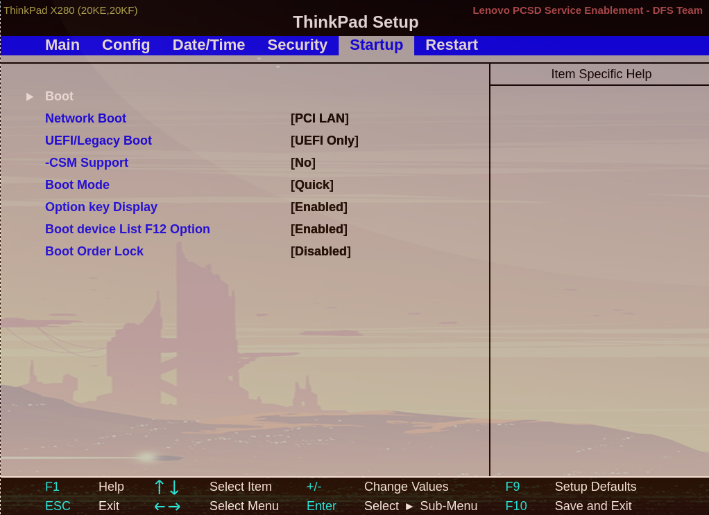
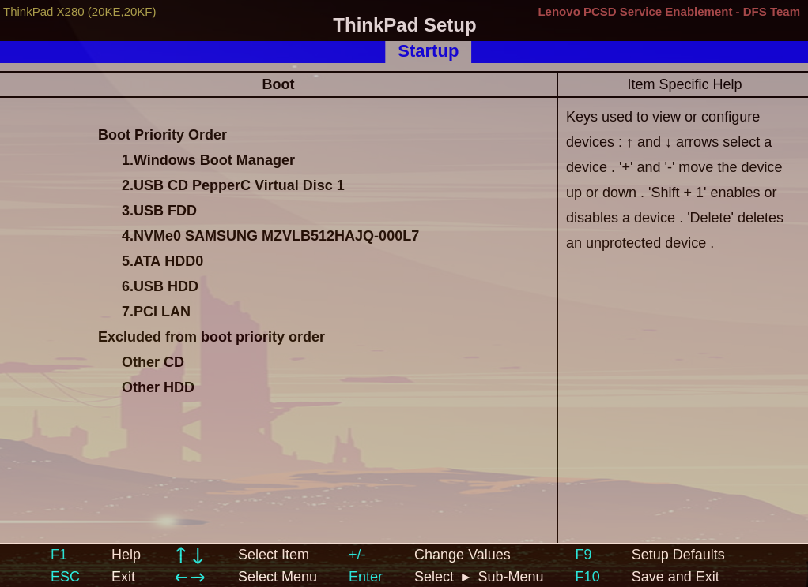

# Get ready with your software -- Two ways

In order to use MTA to do your topic analysis, you can proceed along two ways: 

  1. install Anaconda Software in order to have python: the advantage of this installation is that you are working with your operating system without changing your habits; however, one of the inconvenient to proceed like this is the lack of native unix low level programs which enable you to preprocess and sort your data -- this is not a big deal for MacOS user who can rely on OSX and their tools for this task, since OSX has some of the unix utilities that you most often use when you have to preprocess and sort your data. This is particularly a problem for windows users who do not have these tools native. There is however two solution to this problem: 
    a. use GNUWin32 programs that run on windows from [this page](http://gnuwin32.sourceforge.net/packages.html) -- with these programs, you have an almost working basic unix environment at the command line;
    b. get [WSL for windows](https://docs.microsoft.com/en-us/windows/wsl/install) which implements bash in windows: this has been not tested and won't be covered in these lectures, but it should work.
    
  2. install a standard Linux distribution on a USB external device: even if it is a bit demanding technically speaking, it will give you a complete Linux operating system on a pendrive that you can take with you everywhere you go.
  
This could be sound like a detail, because what we want to do with our data is topic-model analysis. However, don't underestimate this task of preprocessing and sort your data, because the quality of your models will depend on the result of these tasks. In practice, we often spend more time to tailor our data than to do the topic analysis itself.  


## Install Anaconda

If you are found on the operations consisting in preprocessing a corpus to be fed into MTA, i.e. if you have good command on the several steps you have to perform in order to get a clean corpus, then you could just install Anaconda and the python libraries that MTA needs, and off you go with MTA. 

### Windows and Mac OS users -- Install Anaconda and the needed libraries for MTA ===

For Windows and Mac OS users not comfortable at the command line, I recommend  for windows to use [this link](https://www.anaconda.com/download/#windows) [for Mac this one](https://www.anaconda.com/download/#download) which installs Python 2.7 or 3.x either for 32 or 64 bits architectures -- Note: last versions of MTA works with python3.x only. 

You can then use the conda installer in order to install the requested packages for MTA -- note that most of the important packages which MTA requires are already provided by Anaconda, so that you only have to follow the steps bellow in order to install missing packages: 

  * open Anaconda Navigator; your should see 'Environments', and 'base(root)' on the top right;
  * click on base(root) and on 'open Terminal' in the expanded menu -- choose the Anaconda Terminal (called 'Terminal'), not the Python Terminal;
  * in the Terminal, install the following packages with conda like this: 

``` 
conda install gensim python-louvain
```

  * in the Terminal, install the 'community' package with pip like this: 

```
pip install community
```

Anaconda provides an easy way to keep your packages updated -- don't forget to update them to stay on track with the development of MTA.

  * you miss two packages that you have to download [at Christoph Gohlke web page](https://www.lfd.uci.edu/~gohlke/pythonlibs/): these are 'pycairo' and 'wordcloud' -- choose the packages at the top of each list and download the suitable package for your system (either the 32-bit or the 64-bit package). For instance, look at the name of the file; f.ex. pycairo‑1.18.0‑cp27‑cp27m‑win_amd64.whl means a package pycairo, version 1.18.0 for python 2.7 (cp27) and for the Windows 64 bits operating system; if you have Anaconda installed with python3.4 f.ex., then you must use a package with cp34 in the filename; 
  * once downloaded, copy/paste these packages there where your Terminal has been opened -- if your Terminal shows a prompt with: '<base>C:\Users\Downloads' then make sure that your two packages are under 'C:\Users\Downloads'
  * finally, install these packages with pip in the Terminal, for example here for a 64-bit windows OS: 

```
pip install pycairo‑1.18.0‑cp27‑cp27m‑win_amd64.whl \
wrapt‑1.11.2‑cp27‑cp27m‑win_amd64.whl
```

  * it might be that windows' users -- depending on their version of windows -- have to install qt5; from the Anaconda Navigator using the Terminal, type: pip install python-qt5
  * after that, download MTA and open it from the Anaconda Navigator by using the Terminal -- there too, make sure that MTA is in the folder where the Terminal opens (f.ex. in 'C:\Users\Downloads' if the Terminal shows a prompt like '<base>C:\Users\Downloads'); run MTA by typing in the Terminal: python MTA-1.0.py (here for the last version of MTA in Python 2.7) or python MTA3-1.4.py (for the last version of MTA in Python 3.x). 

MTA will crash if your path is not writable for the user -- make sure that you have sufficient permission in your path before processing. In doubt, ask your admin.


## Install Linux on a USB external device

**Motivation**: You can do all your work from a USB key with a full Linux desktop on it. This is especially useful if you don't want to touch the installed system on your computer, and if you have to move from your home/office to other places often. 

**Disclaimer**: this is a tutorial for beginners with no experience in such installation. Follow it step by step, and do a backup of your sensible data if something goes wrong. We don't take any kind of responsibility if you lose your data -- you have been warned. 

In this example, we are going to install a Linux mainstream distribution on an external drive, in our case on a USB pendrive/key. You will need: 

 - a USB key with a minimum of 4GB: we will use this key in order to write an * .iso file to it. This * .iso file is the file of the Linux distribution you have downloaded. We will use this key as the one from which we will install Linux
 - a (second and bigger) USB key -- we will use a 32 GB USB key which will be the key on which we install Linux from the 4GB key. You can use a bigger key, an external drive (as f.ex. a SSD drive)
 - an * .iso file: in this example, we are using the last Linux Mint distribution (at the time of writing), that you can find here: https://linuxmint.com/download.php -- We are downloading the MATE edition, because the desktop is faster than the cinnamon edition, and it is near to what you have if you are working in Windows. 

## First step -- Download a Linux mainstream distribution

  - go to [this link](https://linuxmint.com/download.php) and click on "Download"
  - on the page, that has been opened after you have clicked on "Download", go to "Download mirrors" and chose a mirror in your country
  - click on the mirror site and save the * .iso file in one of your folder (f.ex. the Download folder of your desktop)
  - wait until the download has completed

## Second step -- Write the iso file on your 4GB key

  - IF ON MACOS: download the following [free software](https://www.sysgeeker.com/download/wonderiso-for-mac.dmg) to write your file to the USB key. 
  - IF ON WINDOWS: download the [same software for windows](https://www.sysgeeker.com/download/wonderiso-for-windows.exe)
  
The software is easy to use. You have to:

  - plug your 4GB USB key into a USB port
  - then open wonderiso as administrator
  - in wonderiso, click on "Burn"
  - on the next screen, browse to your * .iso file (* .iso image)
  - chose below "Create a bootable USB"
  - chose below "System File", scroll to "Fat 32"
  - below on the right, click on "Burn"
  - wait some time until the software has burnt the file on your USB drive
  - shutdown your computer at the end of the process
  
## Third step -- Reboot your computer with your 4GB USB inserted in a USB port

  - before you reboot your computer, you have to plug your 4GB USB key into a USB port of your computer
  - depending on your hardware, follow the correct procedure: 
    - ON MACOS: 
      * before booting your computer, hold the the Option/alt (⌥) key pressed
      * a menu should come up with the drives that you can boot -- chose your 4GB USB key
    - ON Windows: 
      * before booting your computer, hold the F12 key pressed -- on some system, it is the Esc key (mostly HP), or the F8 (Asus), or the F9, or the F5 key; try them out
      * boot/start your computer
      * a boot menu should come up with the list of the drives you can boot from -- chose your 4GB USB key

Troubleshooting: 

  - Windows: there is no boot menu showing up:
    - if at boot in the first screen you see "Press Enter to interrupt normal startup", first press Enter and then hold the F12 key (or another possible one) pressed
    - be sure that you have enabled booting from USB in your BIOS; in doubt, do the following:
      - boot/start your computer and hold the Del key (for delete) pressed
      - you are opening your BIOS -- here is an example of mine:





  - go to "Startup" (or similar), and in "Startup", go to boot (or similar)





  - in the boot section of "Startup", be sure that USB FDD or USB HDD is present, as in my BIOS





  - you can move USB FDD to the top of the list (first position) in order to insure that your BIOS first look at a system on USB keys before going to the windows boot manager
  - once done, hit F10 to save your properties and exit the bios, your computer will reboot


## Fourth step -- Install Linux on 32GB USB key

  - at this point, you should see the Linux Mint desktop
  - you can follow [this link](https://forums.linuxmint.com/viewtopic.php?f=42&t=287353) and take the hybrid install which is an easy and secure way to install your complete Linux mint on your 32GB USB key
  - you can follow my video tutorial based on the upper link which shows you how to do this kind of installation in few steps:


  - English: [Install video](https://cp.soziologie.uni-halle.de/MQD/LinuxInstall-EN.webm) and [Post-install video](https://cp.soziologie.uni-halle.de/MQD/LinuxPostinstall-EN.webm)
  - German: [Install video](https://cp.soziologie.uni-halle.de/MQD/Linuxinstall-DE.webm) and [Post-install video](https://cp.soziologie.uni-halle.de/MQD/LinuxPostInstall-DE.webm)


## Install python packages for the MTA software

You can follow the simple steps to install the needed python packages in order to use the MTA software: 

  - English: [Install video](https://cp.soziologie.uni-halle.de/MQD/LinuxPythonInstall-EN.webm)
  - German: [Install video](https://cp.soziologie.uni-halle.de/MQD/LinuxPythonInstall-DE.webm)
